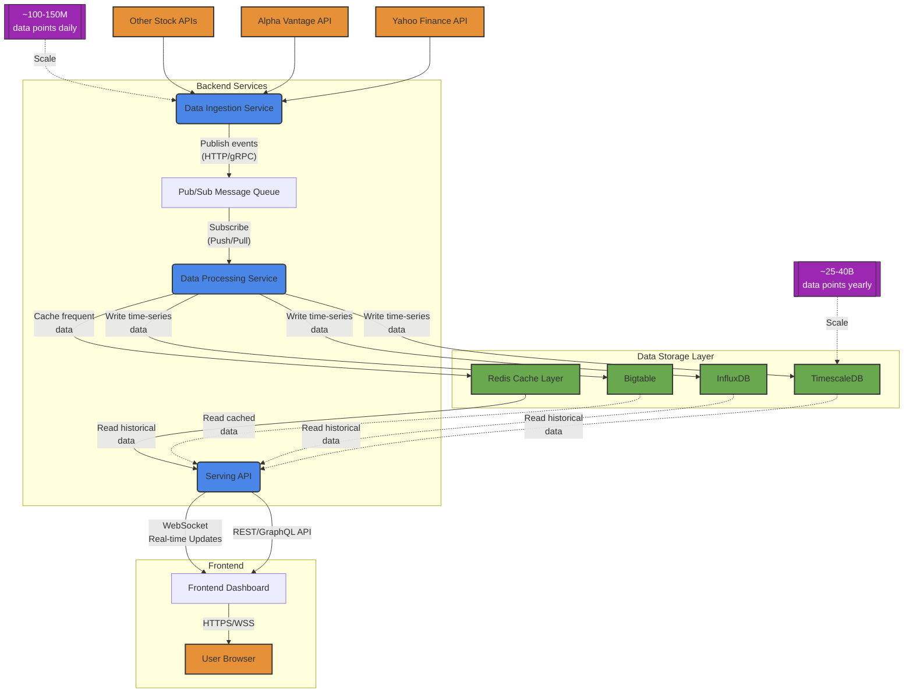

```mermaid
graph TD
    %% External Data Sources
    A1[Yahoo Finance API] --> B
    A2[Alpha Vantage API] --> B
    A3[Other Stock APIs] --> B
    
    %% Core Data Pipeline
    B(Data Ingestion Service) -->|"Publish events<br>(HTTP/gRPC)"| C[Pub/Sub Message Queue]
    C -->|"Subscribe<br>(Push/Pull)"| D(Data Processing Service)
    
    %% Data Storage
    D -->|"Write time-series<br>data"| E1[TimescaleDB]
    D -->|"Write time-series<br>data"| E2[InfluxDB]
    D -->|"Write time-series<br>data"| E3[Bigtable]
    
    %% Cache and Query
    D -->|"Cache frequent<br>data"| F[Redis Cache Layer]
    E1 -.->|"Read historical<br>data"| G(Serving API)
    E2 -.->|"Read historical<br>data"| G
    E3 -.->|"Read historical<br>data"| G
    F -->|"Read cached<br>data"| G
    
    %% Frontend Delivery
    G -->|"REST/GraphQL API"| H[Frontend Dashboard]
    G -->|"WebSocket<br>Real-time Updates"| H
    H -->|"HTTPS/WSS"| I[User Browser]

    %% Data Volumes
    J1[["~100-150M<br>data points daily"]] -.->|"Scale"| B
    J2[["~25-40B<br>data points yearly"]] -.->|"Scale"| E1
    
    %% Subgraphs
    subgraph "Data Storage Layer"
        E1
        E2
        E3
        F
    end

    subgraph "Backend Services"
        B
        C
        D
        G
    end

    subgraph "Frontend"
        H
        I
    end

    %% Styling with improved contrast
    classDef service fill:#4a86e8,stroke:#333,stroke-width:2px;
    class B,D,G service;
    classDef data fill:#6aa84f,stroke:#333,stroke-width:2px;
    class E1,E2,E3,F data;
    classDef external fill:#e69138,stroke:#333,stroke-width:2px;
    class A1,A2,A3,I external;
    classDef volume fill:#9c27b0,stroke:#333,stroke-width:1px,color:#fff;
    class J1,J2 volume;
```
