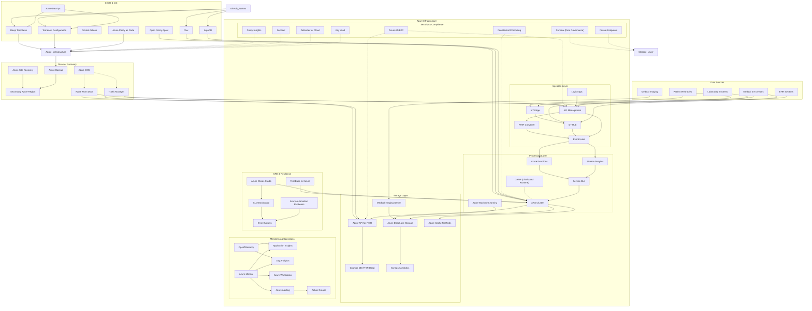

# Healthcare Data Processing Platform

```mermaid
flowchart TB
    subgraph "Data Sources"
        IoT["Medical IoT Devices"]
        EHR["EHR Systems"]
        Lab["Laboratory Systems"]
        %% Added sources
        Imaging["Medical Imaging"]
        Wearables["Patient Wearables"]
    end
    
    subgraph "Azure Infrastructure"
        subgraph "Ingestion Layer"
            EventHubs["Event Hubs"]
            IoTHub["IoT Hub"]
            APIM["API Management"]
            %% Added ingestion components
            IoTEdge["IoT Edge"]
            LogicApps["Logic Apps"]
            FHIR_Converter["FHIR Converter"]
        end
        
        subgraph "Processing Layer"
            AKS["AKS Cluster"]
            Functions["Azure Functions"]
            Stream["Stream Analytics"]
            %% Added processing components
            DAPR["DAPR (Distributed Runtime)"]
            ServiceBus["Service Bus"]
            AzureML["Azure Machine Learning"]
        end
        
        subgraph "Storage Layer"
            CosmosDB["Cosmos DB (FHIR Data)"]
            ADLS["Azure Data Lake Storage"]
            Synapse["Synapse Analytics"]
            %% Added storage components
            Healthcare_API["Azure API for FHIR"]
            MedicalImaging["Medical Imaging Server"]
            CacheForRedis["Azure Cache for Redis"]
        end
        
        subgraph "Security & Compliance"
            KeyVault["Key Vault"]
            Sentinel["Sentinel"]
            Purview["Purview (Data Governance)"]
            PEP["Private Endpoints"]
            %% Added security components
            Defender["Defender for Cloud"]
            Confidential["Confidential Computing"]
            AzureAD["Azure AD B2C"]
            PolicyInsights["Policy Insights"]
        end
        
        subgraph "Monitoring & Operations"
            Monitor["Azure Monitor"]
            AppInsights["Application Insights"]
            LogAnalytics["Log Analytics"]
            %% Added monitoring components
            Workbooks["Azure Workbooks"]
            AlertMgmt["Azure Alerting"]
            ActionGroups["Action Groups"]
            OpenTelemetry["OpenTelemetry"]
        end
        
        %% Added SRE components
        subgraph "SRE & Resilience"
            TestBase["Test Base for Azure"]
            Chaos["Azure Chaos Studio"]
            RunBooks["Azure Automation Runbooks"]
            SLOs["SLO Dashboard"]
            ErrorBudgets["Error Budgets"]
        end
    end
    
    subgraph "CI/CD & IaC"
        Azure_DevOps["Azure DevOps"]
        Terraform["Terraform Configuration"]
        Bicep["Bicep Templates"]
        %% Added DevOps components
        GitHubActions["GitHub Actions"]
        ArgoCD["ArgoCD"]
        Flux["Flux"]
        OPA["Open Policy Agent"]
        AzPolicy["Azure Policy as Code"]
    end
    
    subgraph "Disaster Recovery"
        Backup["Azure Backup"]
        SecondaryRegion["Secondary Azure Region"]
        ASR["Azure Site Recovery"]
        %% Added DR components
        TrafficManager["Traffic Manager"]
        FrontDoor["Azure Front Door"]
        AzureDNS["Azure DNS"]
    end
    
    %% Connections
    IoT & Wearables --> IoTHub
    IoT & Wearables --> IoTEdge
    EHR --> APIM
    Lab --> APIM
    Imaging --> MedicalImaging
    
    APIM --> EventHubs
    APIM --> FHIR_Converter
    IoTHub --> EventHubs
    FHIR_Converter --> EventHubs
    IoTEdge --> IoTHub
    LogicApps --> APIM
    
    EventHubs --> Stream
    EventHubs --> Functions
    Stream --> ServiceBus
    Functions --> ServiceBus
    ServiceBus --> AKS
    
    DAPR -.- AKS
    
    AKS --> Healthcare_API
    Healthcare_API --> CosmosDB
    AKS --> ADLS
    AKS --> CacheForRedis
    ADLS --> Synapse
    AzureML --> ADLS
    MedicalImaging --> ADLS
    
    KeyVault -.-> Azure_Infrastructure
    PEP -.-> Storage_Layer
    Defender -.-> Azure_Infrastructure
    Confidential -.-> AKS
    Sentinel -.-> Azure_Infrastructure
    Purview -.-> Storage_Layer
    AzureAD -.-> APIM & Healthcare_API
    PolicyInsights -.-> Azure_Infrastructure
    
    Monitor --> AppInsights
    Monitor --> LogAnalytics
    Monitor --> Workbooks
    Monitor --> AlertMgmt
    AlertMgmt --> ActionGroups
    OpenTelemetry --> AppInsights & LogAnalytics
    
    Azure_DevOps --> Terraform & Bicep
    GitHub_Actions --> Terraform & Bicep
    GitHub_Actions --> ArgoCD & Flux
    ArgoCD & Flux --> AKS
    OPA --> AKS
    AzPolicy --> Azure_Infrastructure
    Terraform & Bicep --> Azure_Infrastructure
    
    Chaos --> AKS
    TestBase --> AKS
    Chaos --> SLOs
    RunBooks --> ErrorBudgets
    SLOs --> ErrorBudgets
    
    Backup --> SecondaryRegion
    ASR --> SecondaryRegion
    Azure_Infrastructure --> Backup
    TrafficManager --> APIM & Healthcare_API
    FrontDoor --> APIM & Healthcare_API
    AzureDNS -.-> TrafficManager & FrontDoor
```