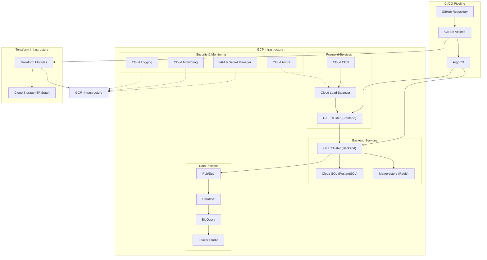

# E-commerce Real-time Inventory & Analytics System

```mermaid
graph TB
    subgraph "CI/CD Pipeline"
        GH["GitHub Repository"]
        Actions["GitHub Actions"]
        ArgoCD["ArgoCD"]
    end

    subgraph "GCP Infrastructure"
        subgraph "Frontend Services"
            CloudCDN["Cloud CDN"]
            CloudLB["Cloud Load Balancer"]
            GKE_FE["GKE Cluster (Frontend)"]
        end
        
        subgraph "Backend Services"
            GKE_BE["GKE Cluster (Backend)"]
            Cloud_SQL["Cloud SQL (PostgreSQL)"]
            Memorystore["Memorystore (Redis)"]
        end
        
        subgraph "Data Pipeline"
            Pub_Sub["Pub/Sub"]
            Dataflow["Dataflow"]
            BigQuery["BigQuery"]
            DataStudio["Looker Studio"]
        end
        
        subgraph "Security & Monitoring"
            IAM["IAM & Secret Manager"]
            CloudArmor["Cloud Armor"]
            Monitoring["Cloud Monitoring"]
            Logging["Cloud Logging"]
        end
    end
    
    subgraph "Terraform Infrastructure"
        TF_Modules["Terraform Modules"]
        TF_State["Cloud Storage (TF State)"]
    end
    
    %% Connections
    GH --> Actions
    Actions --> TF_Modules
    TF_Modules --> GCP_Infrastructure
    TF_Modules --> TF_State
    
    Actions --> ArgoCD
    ArgoCD --> GKE_FE
    ArgoCD --> GKE_BE
    
    CloudCDN --> CloudLB
    CloudLB --> GKE_FE
    GKE_FE --> GKE_BE
    GKE_BE --> Cloud_SQL
    GKE_BE --> Memorystore
    GKE_BE --> Pub_Sub
    
    Pub_Sub --> Dataflow
    Dataflow --> BigQuery
    BigQuery --> DataStudio
    
    IAM -.-> GCP_Infrastructure
    CloudArmor -.-> CloudLB
    Monitoring -.-> GCP_Infrastructure
    Logging -.-> GCP_Infrastructure
```