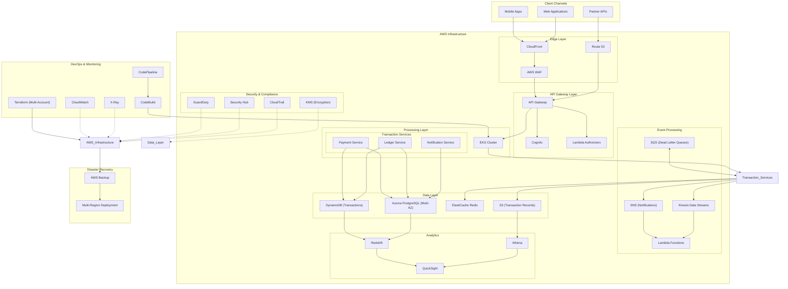

# Fintech Payment Processing System

```mermaid
flowchart TB
    subgraph "Client Channels"
        MobileApp["Mobile Apps"]
        WebApp["Web Applications"]
        PartnerAPI["Partner APIs"]
    end
    
    subgraph "AWS Infrastructure"
        subgraph "Edge Layer"
            CloudFront["CloudFront"]
            WAF["AWS WAF"]
            Route53["Route 53"]
        end
        
        subgraph "API Gateway Layer"
            APIGateway["API Gateway"]
            Cognito["Cognito"]
            Lambda_Auth["Lambda Authorizers"]
        end
        
        subgraph "Processing Layer"
            EKS["EKS Cluster"]
            subgraph "Transaction Services"
                Payment["Payment Service"]
                Ledger["Ledger Service"]
                Notification["Notification Service"]
            end
        end
        
        subgraph "Data Layer"
            Aurora["Aurora PostgreSQL (Multi-AZ)"]
            DynamoDB["DynamoDB (Transactions)"]
            ElastiCache["ElastiCache Redis"]
            S3["S3 (Transaction Records)"]
        end
        
        subgraph "Event Processing"
            SQS["SQS (Dead Letter Queues)"]
            SNS["SNS (Notifications)"]
            Kinesis["Kinesis Data Streams"]
            Lambda["Lambda Functions"]
        end
        
        subgraph "Security & Compliance"
            KMS["KMS (Encryption)"]
            GuardDuty["GuardDuty"]
            SecurityHub["Security Hub"]
            CloudTrail["CloudTrail"]
        end
        
        subgraph "Analytics"
            Redshift["Redshift"]
            QuickSight["QuickSight"]
            Athena["Athena"]
        end
    end
    
    subgraph "DevOps & Monitoring"
        CodePipeline["CodePipeline"]
        CodeBuild["CodeBuild"]
        CloudWatch["CloudWatch"]
        XRay["X-Ray"]
        Terraform["Terraform (Multi-Account)"]
    end
    
    subgraph "Disaster Recovery"
        Backup["AWS Backup"]
        MultiRegion["Multi-Region Deployment"]
    end
    
    %% Connections
    MobileApp & WebApp --> CloudFront
    PartnerAPI --> Route53
    CloudFront --> WAF --> APIGateway
    Route53 --> APIGateway
    
    APIGateway --> Cognito
    APIGateway --> Lambda_Auth
    APIGateway --> EKS
    
    EKS --> Transaction_Services
    
    Payment & Ledger & Notification --> Aurora
    Payment & Ledger --> DynamoDB
    Transaction_Services --> ElastiCache
    Transaction_Services --> S3
    
    Transaction_Services --> SNS
    Transaction_Services --> Kinesis
    SQS <--> Transaction_Services
    SNS --> Lambda
    Kinesis --> Lambda
    
    KMS -.-> Data_Layer
    GuardDuty & SecurityHub & CloudTrail -.-> AWS_Infrastructure
    
    S3 --> Athena
    DynamoDB & Aurora --> Redshift
    Redshift --> QuickSight
    Athena --> QuickSight
    
    CodePipeline --> CodeBuild
    CodeBuild --> EKS
    Terraform --> AWS_Infrastructure
    CloudWatch & XRay -.-> AWS_Infrastructure
    
    Backup --> MultiRegion
    AWS_Infrastructure --> Backup
```