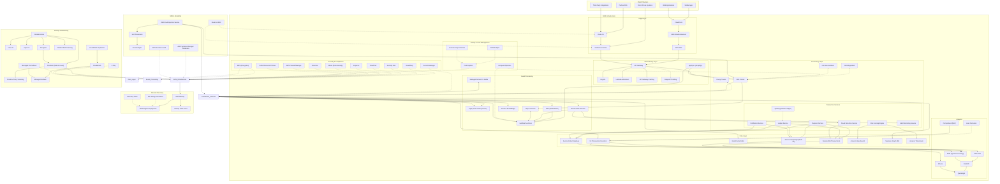

# Fintech Payment Processing System

```mermaid
flowchart TB
    subgraph "Client Channels"
        MobileApp["Mobile Apps"]
        WebApp["Web Applications"]
        PartnerAPI["Partner APIs"]
        %% Added channels
        ThirdParty["Third-Party Integrations"]
        POS["Point of Sale Systems"]
    end
    
    subgraph "AWS Infrastructure"
        subgraph "Edge Layer"
            CloudFront["CloudFront"]
            WAF["AWS WAF"]
            Route53["Route 53"]
            %% Added edge components
            Shield["AWS Shield Advanced"]
            GlobalAccelerator["Global Accelerator"]
        end
        
        subgraph "API Gateway Layer"
            APIGateway["API Gateway"]
            Cognito["Cognito"]
            Lambda_Auth["Lambda Authorizers"]
            %% Added API components
            AppSync["AppSync (GraphQL)"]
            APIGWCaching["API Gateway Caching"]
            APIGWThrottling["Request Throttling"]
        end
        
        subgraph "Processing Layer"
            EKS["EKS Cluster"]
            subgraph "Transaction Services"
                Payment["Payment Service"]
                Ledger["Ledger Service"]
                Notification["Notification Service"]
                %% Added services
                Fraud["Fraud Detection Service"]
                RiskScoring["Risk Scoring Engine"]
                AML["AML Monitoring Service"]
                QuantumLedger["QLDB (Quantum Ledger)"]
            end
            %% Added service mesh
            AppMesh["AWS App Mesh"]
            Istio["Istio Service Mesh"]
            EnvoyProxy["Envoy Proxies"]
        end
        
        subgraph "Data Layer"
            Aurora["Aurora PostgreSQL (Multi-AZ)"]
            DynamoDB["DynamoDB (Transactions)"]
            ElastiCache["ElastiCache Redis"]
            S3["S3 (Transaction Records)"]
            %% Added data components
            AuroraGlobal["Aurora Global Database"]
            Elasticsearch["Amazon OpenSearch"]
            Neptune["Neptune (Graph DB)"]
            Timestream["Amazon Timestream"]
        end
        
        subgraph "Event Processing"
            SQS["SQS (Dead Letter Queues)"]
            SNS["SNS (Notifications)"]
            Kinesis["Kinesis Data Streams"]
            Lambda["Lambda Functions"]
            %% Added event components
            EventBridge["Amazon EventBridge"]
            StepFunctions["Step Functions"]
            MSK["Managed Service for Kafka"]
        end
        
        subgraph "Security & Compliance"
            KMS["KMS (Encryption)"]
            GuardDuty["GuardDuty"]
            SecurityHub["Security Hub"]
            CloudTrail["CloudTrail"]
            %% Added security components
            SecretsManager["Secrets Manager"]
            Inspector["Inspector"]
            Macie["Macie (Data Security)"]
            Detective["Detective"]
            AWSWAF["AWS Firewall Manager"]
            IAM["IAM & Resource Policies"]
        end
        
        subgraph "Analytics"
            Redshift["Redshift"]
            QuickSight["QuickSight"]
            Athena["Athena"]
            %% Added analytics components
            EMR["EMR (Spark Processing)"]
            Glue["AWS Glue"]
            LakeFormation["Lake Formation"]
            Comprehend["Comprehend (NLP)"]
        end
        
        %% Added FinOps
        subgraph "FinOps & Cost Management"
            CostExplorer["Cost Explorer"]
            Budgets["AWS Budgets"]
            CostAnomalyDetection["Cost Anomaly Detection"]
            ComputeOptimizer["Compute Optimizer"]
        end
    end
    
    subgraph "DevOps & Monitoring"
        %% Replaced CodePipeline with modern tools
        GHActions["GitHub Actions"]
        FluxCD["Flux CD"]
        ArgoCD["Argo CD"]
        CloudWatch["CloudWatch"]
        XRay["X-Ray"]
        %% Added modern DevOps tools
        Terraform["Terraform (Multi-Account)"]
        TerragruntConfig["Terragrunt"]
        OWASP["OWASP ZAP Scanning"]
        Checkov["Checkov Policy Scanning"]
        Grafana["Managed Grafana"]
        Prometheus["Managed Prometheus"]
        SyntheticCanary["CloudWatch Synthetics"]
    end
    
    subgraph "SRE & Reliability"
        AWSFis["AWS Fault Injection Service"]
        RouteConfig["Route 53 ARC"]
        SLOFramework["SLO Framework"]
        ErrorBudgets["Error Budgets"]
        RunBooks["AWS Systems Manager Runbooks"]
        Resilience["AWS Resilience Hub"]
    end
    
    subgraph "Disaster Recovery"
        Backup["AWS Backup"]
        MultiRegion["Multi-Region Deployment"]
        %% Added DR components
        DRTests["DR Testing Framework"]
        BackupVault["Backup Vault Locks"]
        RecoveryPlans["Recovery Plans"]
    end
    
    %% Connections
    MobileApp & WebApp --> CloudFront
    PartnerAPI & ThirdParty --> Route53
    POS --> GlobalAccelerator
    CloudFront --> Shield --> WAF --> APIGateway
    Route53 --> GlobalAccelerator --> APIGateway
    
    APIGateway --> Cognito
    APIGateway --> Lambda_Auth
    APIGateway --> APIGWCaching
    APIGateway -.-> APIGWThrottling
    
    AppSync --> Lambda
    APIGateway & AppSync --> EKS
    
    %% Service Mesh and EKS
    AppMesh <-.-> EKS
    Istio <-.-> EKS
    EnvoyProxy <-.-> Transaction_Services
    
    %% Transaction Services
    EKS --> Transaction_Services
    EKS --> StepFunctions
    
    Payment & Ledger & Notification --> Aurora & AuroraGlobal
    Payment & Ledger & Fraud --> DynamoDB
    Transaction_Services --> ElastiCache
    Transaction_Services --> S3
    Transaction_Services --> Neptune
    RiskScoring --> Timestream & Elasticsearch
    
    Transaction_Services --> SQS & SNS & Kinesis & EventBridge
    SQS <--> Transaction_Services
    SNS --> Lambda
    Kinesis --> Lambda
    Kinesis --> Fraud & AML
    
    QuantumLedger -.-> Ledger
    
    StepFunctions <--> Lambda
    Lambda --> Transaction_Services
    MSK <--> Transaction_Services
    
    %% Security connections
    KMS -.-> Data_Layer
    KMS -.-> Event_Processing
    SecretsManager -.-> Transaction_Services
    GuardDuty & SecurityHub & CloudTrail & Inspector & Macie & Detective & AWSWAF -.-> AWS_Infrastructure
    IAM -.-> AWS_Infrastructure
    
    %% Analytics connections
    S3 --> Athena
    S3 --> Glue
    Glue --> Redshift
    LakeFormation -.-> S3
    DynamoDB & Aurora & AuroraGlobal --> EMR
    EMR --> Redshift
    Redshift & Athena --> QuickSight
    Comprehend --> S3
    
    %% DevOps connections
    GHActions --> ArgoCD & FluxCD
    GHActions --> Terraform & TerragruntConfig
    GHActions --> OWASP
    Terraform --> Checkov
    TerragruntConfig --> Terraform
    Terraform --> AWS_Infrastructure
    CloudWatch & XRay & Prometheus -.-> AWS_Infrastructure
    CloudWatch & Prometheus --> Grafana
    SyntheticCanary --> CloudWatch
    
    %% FinOps connections
    CostExplorer -.-> AWS_Infrastructure
    Budgets -.-> CostExplorer
    CostAnomalyDetection -.-> CostExplorer
    ComputeOptimizer -.-> EKS & Lambda
    
    %% SRE connections
    AWSFis --> SLOFramework
    AWSFis --> EKS & Transaction_Services
    SLOFramework --> ErrorBudgets
    RouteConfig -.-> Route53 & GlobalAccelerator
    RunBooks -.-> AWS_Infrastructure
    Resilience -.-> AWS_Infrastructure
    
    %% DR connections
    Backup --> MultiRegion & BackupVault
    AWS_Infrastructure --> Backup
    DRTests -.-> MultiRegion
    RecoveryPlans -.-> MultiRegion
```