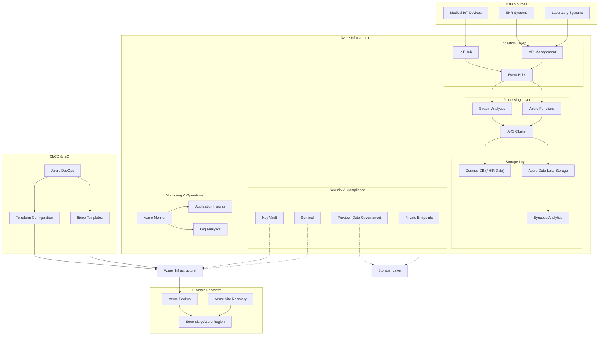

# Healthcare Data Processing Platform

```mermaid
flowchart TB
    subgraph "Data Sources"
        IoT["Medical IoT Devices"]
        EHR["EHR Systems"]
        Lab["Laboratory Systems"]
    end
    
    subgraph "Azure Infrastructure"
        subgraph "Ingestion Layer"
            EventHubs["Event Hubs"]
            IoTHub["IoT Hub"]
            APIM["API Management"]
        end
        
        subgraph "Processing Layer"
            AKS["AKS Cluster"]
            Functions["Azure Functions"]
            Stream["Stream Analytics"]
        end
        
        subgraph "Storage Layer"
            CosmosDB["Cosmos DB (FHIR Data)"]
            ADLS["Azure Data Lake Storage"]
            Synapse["Synapse Analytics"]
        end
        
        subgraph "Security & Compliance"
            KeyVault["Key Vault"]
            Sentinel["Sentinel"]
            Purview["Purview (Data Governance)"]
            PEP["Private Endpoints"]
        end
        
        subgraph "Monitoring & Operations"
            Monitor["Azure Monitor"]
            AppInsights["Application Insights"]
            LogAnalytics["Log Analytics"]
        end
    end
    
    subgraph "CI/CD & IaC"
        Azure_DevOps["Azure DevOps"]
        Terraform["Terraform Configuration"]
        Bicep["Bicep Templates"]
    end
    
    subgraph "Disaster Recovery"
        Backup["Azure Backup"]
        SecondaryRegion["Secondary Azure Region"]
        ASR["Azure Site Recovery"]
    end
    
    %% Connections
    IoT --> IoTHub
    EHR --> APIM
    Lab --> APIM
    APIM --> EventHubs
    IoTHub --> EventHubs
    
    EventHubs --> Stream
    EventHubs --> Functions
    Stream --> AKS
    Functions --> AKS
    
    AKS --> CosmosDB
    AKS --> ADLS
    ADLS --> Synapse
    
    KeyVault -.-> Azure_Infrastructure
    PEP -.-> Storage_Layer
    Sentinel -.-> Azure_Infrastructure
    Purview -.-> Storage_Layer
    
    Monitor --> AppInsights
    Monitor --> LogAnalytics
    
    Azure_DevOps --> Terraform
    Azure_DevOps --> Bicep
    Terraform --> Azure_Infrastructure
    Bicep --> Azure_Infrastructure
    
    Backup --> SecondaryRegion
    ASR --> SecondaryRegion
    Azure_Infrastructure --> Backup
```