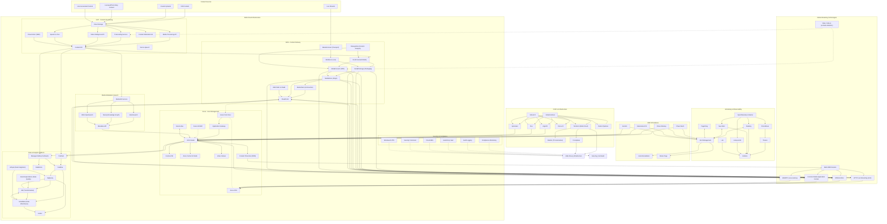

# Media Streaming Platform

```mermaid
flowchart TB
    subgraph "Content Sources"
        LiveStreams["Live Streams"]
        VODContent["VOD Content"]
        Uploads["Creator Uploads"]
        %% Added content sources
        ThirdPartyContent["Licensed/Third-Party Content"]
        UserGeneratedContent["User-Generated Content"]
    end
    
    subgraph "Multi-Cloud Infrastructure"
        subgraph "GCP - Content Processing"
            GCS["Cloud Storage"]
            MediaProcessing["Media Processing API"]
            Transcoder["Transcoding Service"]
            ContentAPI["Content API"]
            %% Added GCP components
            VideoIntelligence["Video Intelligence API"]
            SpeechToText["Speech-to-Text"]
            TextToSpeech["Text-to-Speech"]
            ContentModeration["Content Moderation AI"]
            CloudArmor["Cloud Armor (WAF)"]
        end
        
        subgraph "AWS - Content Delivery"
            S3["S3 (Processed Media)"]
            MediaConvert["MediaConvert (VOD)"]
            MediaLive["MediaLive (Live)"]
            CloudFront["CloudFront"]
            %% Added AWS components
            MediaPackage["MediaPackage (Packaging)"]
            MediaStore["MediaStore (Origin)"]
            MediaTailor["MediaTailor (Ad Insertion)"]
            Rekognition["Rekognition (Content Analysis)"]
            MediaConnect["MediaConnect (Transport)"]
            AWS_WAF["AWS WAF & Shield"]
        end
        
        subgraph "Azure - User Management"
            AKS["AKS Cluster"]
            CosmosDB["Cosmos DB"]
            Redis["Azure Cache for Redis"]
            AppGateway["Application Gateway"]
            %% Added Azure components
            FrontDoor["Azure Front Door"]
            AzureAD["Azure AD B2C"]
            VideoIndexer["Video Indexer"]
            ContentProtection["Content Protection (DRM)"]
            AzureCDN["Azure CDN"]
            ServiceBus["Service Bus"]
        end
        
        subgraph "Data & Analytics Platform"
            BigQuery["BigQuery"]
            DataFlow["Dataflow"]
            Looker["Looker"]
            PubSub["Pub/Sub"]
            %% Added analytics components
            Kafka["Managed Kafka (Confluent)"]
            Snowflake["Snowflake (Data Warehouse)"]
            dbt["dbt (Transformation)"]
            Databricks["Databricks"]
            GreatExpectations["Great Expectations (Data Quality)"]
            Airbyte["Airbyte (Data Integration)"]
        end
        
        %% Added Media Metadata & Search
        subgraph "Media Metadata & Search"
            Elasticsearch["Elasticsearch"]
            Neo4j["Neo4j (Knowledge Graph)"]
            OpenSearch["AWS OpenSearch"]
            MediaInfo["MediaInfo Service"]
            MetadataAPI["Metadata API"]
        end
        
        %% Added Security & Compliance
        subgraph "Security & Compliance"
            VaultHC["HashiCorp Vault"]
            CloudKMS["Cloud KMS"]
            SecurityCommand["Security Command"]
            WireGuard["WireGuard VPN"]
            Compliance["Compliance Monitoring"]
            Audit["Audit Logging"]
        end
    end
    
    subgraph "CI/CD & Infrastructure"
        GitHubActions["GitHub Actions"]
        ArgoCD["ArgoCD"]
        Terraform["Terraform (Multi-Cloud)"]
        Atlantis["Atlantis (TF Automation)"]
        %% Added CI/CD components
        Flux["Flux"]
        Drone["Drone CI"]
        Spinnaker["Spinnaker"]
        Crossplane["Crossplane"]
        Tekton["Tekton Pipelines"]
        GitLabCI["GitLab CI"]
    end
    
    subgraph "Monitoring & Observability"
        Datadog["Datadog"]
        Prometheus["Prometheus"]
        Grafana["Grafana"]
        PagerDuty["PagerDuty"]
        %% Added observability components
        Honeycomb["Honeycomb"]
        NewRelic["New Relic"]
        OpenTelemetry["OpenTelemetry Collector"]
        Thanos["Thanos"]
        Loki["Loki"]
        SLOs["SLO Management"]
    end
    
    %% Added SRE & Resilience
    subgraph "SRE & Resilience"
        ChaosMesh["Chaos Mesh"]
        ChaosMonkey["Chaos Monkey"]
        KubernetesFIS["Kubernetes FIS"]
        AutoRemediation["Auto-Remediation"]
        StatusPage["Status Page"]
        GremlinInc["Gremlin"]
    end
    
    %% Added Media Streaming Technologies
    subgraph "Media Streaming Technologies"
        HLS["HTTP Live Streaming (HLS)"]
        DASH["MPEG-DASH"]
        CMAF["Common Media Application Format"]
        WebRTC["WebRTC (Low Latency)"]
        DRM["Multi-DRM Solution"]
        VideoCodecs["Video Codecs (H.264/H.265/AV1)"]
    end
    
    %% Connections
    LiveStreams --> MediaConnect
    MediaConnect --> MediaLive
    VODContent & Uploads & ThirdPartyContent & UserGeneratedContent --> GCS
    
    GCS --> MediaProcessing
    GCS --> Transcoder
    GCS --> VideoIntelligence
    GCS --> SpeechToText
    GCS --> ContentModeration
    MediaProcessing & Transcoder & VideoIntelligence & SpeechToText --> ContentAPI
    ContentAPI --> S3
    CloudArmor --> ContentAPI
    
    S3 --> MediaConvert
    S3 --> MediaPackage
    MediaPackage --> MediaStore
    MediaLive --> MediaPackage
    MediaConvert --> MediaStore
    MediaStore --> MediaTailor
    MediaTailor --> CloudFront
    MediaStore --> CloudFront
    AWS_WAF --> CloudFront
    
    Rekognition --> S3 & MediaConvert
    
    CloudFront -.-> FrontDoor
    FrontDoor --> AppGateway
    AppGateway --> AKS
    AKS --> CosmosDB
    AKS --> Redis
    AKS --> VideoIndexer
    AKS --> ContentProtection
    AzureCDN -.-> FrontDoor
    AzureAD -.-> AKS
    
    ContentAPI & AKS --> PubSub & Kafka
    PubSub --> DataFlow
    Kafka --> DataFlow & Databricks
    DataFlow --> BigQuery & Snowflake
    BigQuery & Snowflake --> Looker
    BigQuery & Snowflake --> dbt
    dbt --> BigQuery & Snowflake
    Airbyte --> BigQuery & Snowflake
    GreatExpectations --> dbt
    
    ContentAPI --> MediaInfo
    MediaInfo --> Elasticsearch & Neo4j & OpenSearch
    Elasticsearch & Neo4j & OpenSearch --> MetadataAPI
    MetadataAPI --> AKS
    
    ServiceBus <--> AKS
    
    VaultHC -.-> Multi-Cloud_Infrastructure
    CloudKMS -.-> Multi-Cloud_Infrastructure
    SecurityCommand -.-> Multi-Cloud_Infrastructure
    WireGuard -.-> Multi-Cloud_Infrastructure
    Compliance -.-> Security_Command
    Audit -.-> Security_Command
    
    GitHubActions & GitLabCI --> Terraform & Drone & Tekton
    GitHubActions & GitLabCI --> ArgoCD & Flux & Spinnaker
    Terraform --> Atlantis & Crossplane
    Terraform & Crossplane --> Multi-Cloud_Infrastructure
    ArgoCD & Flux & Spinnaker --> AKS
    
    OpenTelemetry --> Datadog & Prometheus & NewRelic & Honeycomb
    Prometheus --> Thanos
    Thanos --> Grafana
    Datadog & NewRelic & Honeycomb & Loki --> Grafana
    Datadog & NewRelic & PagerDuty <--> SLOs
    
    ChaosMesh & ChaosMonkey & KubernetesFIS & GremlinInc --> AKS
    ChaosMesh & ChaosMonkey & KubernetesFIS & GremlinInc --> SLOs
    SLOs --> AutoRemediation
    SLOs --> StatusPage
    
    MediaPackage & MediaConvert --> HLS & DASH & CMAF
    MediaStore --> HLS & DASH & CMAF
    AKS --> WebRTC
    HLS & DASH & CMAF & WebRTC --> CloudFront & AzureCDN
    ContentProtection --> DRM
    DRM --> HLS & DASH & CMAF & WebRTC
    VideoCodecs -.-> MediaConvert & Transcoder
```