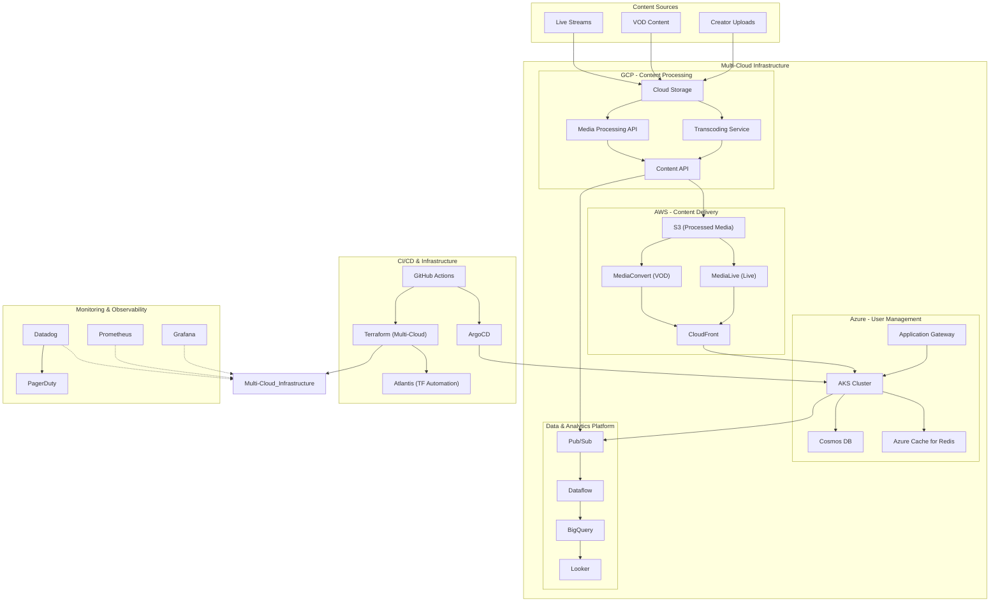

# Media Streaming Platform

```mermaid
flowchart TB
    subgraph "Content Sources"
        LiveStreams["Live Streams"]
        VODContent["VOD Content"]
        Uploads["Creator Uploads"]
    end
    
    subgraph "Multi-Cloud Infrastructure"
        subgraph "GCP - Content Processing"
            GCS["Cloud Storage"]
            MediaProcessing["Media Processing API"]
            Transcoder["Transcoding Service"]
            ContentAPI["Content API"]
        end
        
        subgraph "AWS - Content Delivery"
            S3["S3 (Processed Media)"]
            MediaConvert["MediaConvert (VOD)"]
            MediaLive["MediaLive (Live)"]
            CloudFront["CloudFront"]
        end
        
        subgraph "Azure - User Management"
            AKS["AKS Cluster"]
            CosmosDB["Cosmos DB"]
            Redis["Azure Cache for Redis"]
            AppGateway["Application Gateway"]
        end
        
        subgraph "Data & Analytics Platform"
            BigQuery["BigQuery"]
            DataFlow["Dataflow"]
            Looker["Looker"]
            PubSub["Pub/Sub"]
        end
    end
    
    subgraph "CI/CD & Infrastructure"
        GitHubActions["GitHub Actions"]
        ArgoCD["ArgoCD"]
        Terraform["Terraform (Multi-Cloud)"]
        Atlantis["Atlantis (TF Automation)"]
    end
    
    subgraph "Monitoring & Observability"
        Datadog["Datadog"]
        Prometheus["Prometheus"]
        Grafana["Grafana"]
        PagerDuty["PagerDuty"]
    end
    
    %% Connections
    LiveStreams --> GCS
    VODContent --> GCS
    Uploads --> GCS
    
    GCS --> MediaProcessing
    GCS --> Transcoder
    MediaProcessing & Transcoder --> ContentAPI
    ContentAPI --> S3
    
    S3 --> MediaConvert
    S3 --> MediaLive
    MediaConvert & MediaLive --> CloudFront
    
    CloudFront --> AKS
    AKS --> CosmosDB
    AKS --> Redis
    AppGateway --> AKS
    
    ContentAPI & AKS --> PubSub
    PubSub --> DataFlow
    DataFlow --> BigQuery
    BigQuery --> Looker
    
    GitHubActions --> Terraform
    GitHubActions --> ArgoCD
    Terraform --> Atlantis
    Terraform --> Multi-Cloud_Infrastructure
    ArgoCD --> AKS
    
    Datadog & Prometheus & Grafana -.-> Multi-Cloud_Infrastructure
    Datadog --> PagerDuty
```