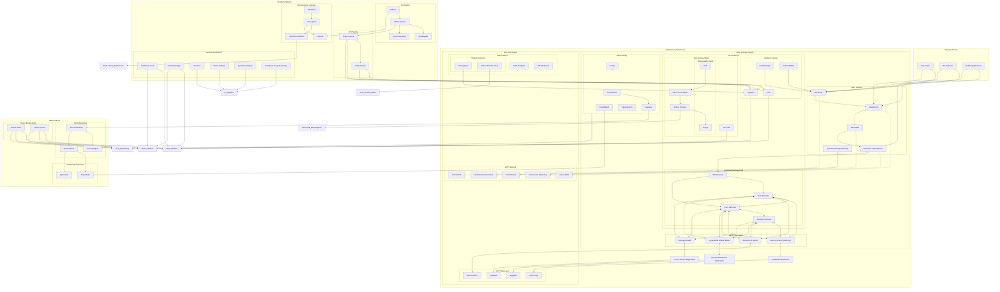

# Cloud-Native Microservices Platform with Service Mesh

```mermaid
flowchart TB
    %% Client Access Layer
    subgraph "External Access"
        Users["End Users"]
        Partners["API Partners"]
        MobileApps["Mobile Applications"]
    end
    
    %% Multi-Cloud Infrastructure
    subgraph "Multi-Cloud Architecture"
        subgraph "AWS Primary Region"
            %% Network Layer
            subgraph "AWS Network"
                Route53["Route 53"]
                CloudFront["CloudFront"]
                WAF["AWS WAF"]
                NLB["Network Load Balancer"]
                AWSTGWp["Transit Gateway (Primary)"]
            end
            
            %% Kubernetes Platform
            subgraph "EKS Platform"
                %% Control Plane
                subgraph "Platform Control"
                    ArgoCD["ArgoCD"]
                    Flux["Flux"]
                    Cert["Cert Manager"]
                    ExternalDNS["ExternalDNS"]
                end
                
                %% Service Mesh
                subgraph "Istio Service Mesh"
                    IstioPilot["Istio Control Plane"]
                    IstioCNI["Istio CNI"]
                    EnvoyProxies["Envoy Proxies"]
                    subgraph "Observability Tools"
                        Kiali["Kiali"]
                        Jaeger["Jaeger"]
                    end
                end
                
                %% Application Workloads
                subgraph "Workload Namespaces"
                    AuthSvc["Auth Services"]
                    APIGateway["API Gateway"]
                    CoreSvc["Core Services"]
                    AuxSvc["Auxiliary Services"]
                end
            end
            
            %% Data Services
            subgraph "AWS Data Layer"
                AuroraCluster["Aurora Cluster (Multi-AZ)"]
                ElastiCache["ElastiCache Redis"]
                DynamoDB["DynamoDB Global Tables"]
                MSK["Managed Kafka"]
            end
            
            %% Observability Stack
            subgraph "Observability"
                Prometheus["Prometheus"]
                Grafana["Grafana"]
                CloudWatch["CloudWatch"]
                XRay["X-Ray"]
                OpenSearch["OpenSearch"]
            end
        end
        
        %% DR Region
        subgraph "GCP DR Region"
            %% DR Network
            subgraph "GCP Network"
                CloudDNS["Cloud DNS"]
                CloudCDN["Cloud CDN"]
                CloudArmor["Cloud Armor"]
                GCPLB["Cloud Load Balancing"]
                GCPInterconnect["Dedicated Interconnect"]
            end
            
            %% DR Kubernetes
            subgraph "GKE Platform"
                GKEAutopilot["GKE Autopilot"]
                subgraph "Platform Services"
                    ConfigSync["Config Sync"]
                    ASM["Anthos Service Mesh"]
                end
                DrWorkloads["DR Workloads"]
            end
            
            %% DR Data
            subgraph "GCP Data Layer"
                CloudSQL["Cloud SQL"]
                MemoryStore["Memorystore"]
                Bigtable["Bigtable"]
                Pub_Sub["Pub/Sub"]
            end
        end
        
        %% Multi-Region Replication
        RepAurora["Database Replication"]
        RepDynamo["DynamoDB Global Replication"]
        RepEvents["Event Stream Replication"]
    end
    
    %% DevOps & Automation
    subgraph "DevOps Platform"
        subgraph "CI Pipeline"
            GitHub["GitHub"]
            GHActions["GitHub Actions"]
            SonarQube["SonarQube"]
            ArtifactRegistry["Artifact Registry"]
        end
        
        subgraph "CD Pipeline"
            ArgoProj["Argo Projects"]
            HelmCharts["Helm Charts"]
        end
        
        subgraph "Infrastructure as Code"
            Terraform["Terraform"]
            Terragrunt["Terragrunt"]
            Atlantis["Atlantis"]
            TFModules["Terraform Modules"]
        end
        
        subgraph "Security Automation"
            Vault["HashiCorp Vault"]
            SecretManager["Secret Manager"]
            Checkov["Checkov"]
            SAST["Static Analysis"]
            DAST["Dynamic Analysis"]
            ImageScanner["Container Image Scanning"]
        end
    end
    
    %% SRE & Monitoring
    subgraph "SRE Platform"
        subgraph "Incident Management"
            PagerDuty["PagerDuty"]
            OpsGenie["OpsGenie"]
        end
        
        subgraph "SLO Monitoring"
            SLOs["SLO Definitions"]
            ErrorBudgets["Error Budgets"]
            Alerts["Alert Policies"]
        end
        
        subgraph "Chaos Engineering"
            ChaosMesh["Chaos Mesh"]
            LitmusChaos["Litmus Chaos"]
        end
    end
    
    %% Connections
    Users & Partners & MobileApps --> Route53
    Users & MobileApps --> CloudFront
    Partners --> NLB
    
    Route53 -.-> CloudDNS
    CloudFront -.-> CloudCDN
    WAF -.-> CloudArmor
    NLB -.-> GCPLB
    AWSTGWp <--> GCPInterconnect
    
    Route53 --> CloudFront
    CloudFront --> WAF --> NLB --> APIGateway
    
    GitHub --> GHActions
    GitHub --> Atlantis
    
    GHActions --> SonarQube
    GHActions --> ArtifactRegistry
    GHActions --> ArgoProj
    
    Terraform --> Terragrunt
    Terragrunt --> TFModules
    Terragrunt --> Atlantis
    TFModules --> Multi-Cloud_Architecture
    
    ArgoProj --> HelmCharts
    ArgoProj --> ArgoCD & Flux
    HelmCharts --> ArgoCD & Flux
    
    ArgoCD --> EKS_Platform
    Flux --> GKE_Platform
    
    Vault --> EKS_Platform & GKE_Platform
    SecretManager --> EKS_Platform & GKE_Platform
    
    Checkov & SAST & DAST & ImageScanner --> CI_Pipeline
    
    IstioPilot --> EnvoyProxies
    IstioCNI --> EKS_Platform
    
    EnvoyProxies --> Workload_Namespaces
    EnvoyProxies --> Jaeger
    Kiali --> IstioPilot
    
    AuthSvc <--> CoreSvc
    APIGateway --> AuthSvc
    APIGateway --> CoreSvc
    CoreSvc <--> AuxSvc
    
    AuthSvc & CoreSvc & AuxSvc <--> AuroraCluster & ElastiCache & DynamoDB & MSK
    
    Cert & ExternalDNS --> Route53
    ConfigSync --> ArgoCD
    ASM --> Istio_Service_Mesh
    
    AuroraCluster <--> RepAurora --> CloudSQL
    DynamoDB <--> RepDynamo --> Bigtable
    MSK <--> RepEvents --> Pub_Sub
    ElastiCache <--> MemoryStore
    
    Prometheus --> Grafana
    Grafana --> SLOs
    SLOs --> ErrorBudgets
    SLOs --> Alerts
    
    Alerts --> PagerDuty & OpsGenie
    CloudWatch --> PagerDuty
    XRay --> Observability
    
    ChaosMesh & LitmusChaos --> EKS_Platform & GKE_Platform
    ChaosMesh & LitmusChaos --> SLO_Monitoring
    
    Observability --> SLO_Monitoring
```