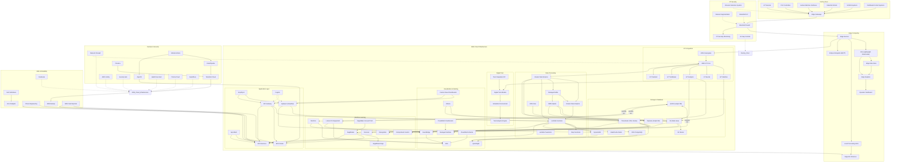

# IoT-Based Smart Manufacturing System

```mermaid
flowchart TB
    subgraph "Factory Floor"
        Sensors["IoT Sensors"]
        Gateways["Edge Gateways"]
        Controllers["PLC Controllers"]
        %% Added industrial components
        HMI["Human Machine Interfaces"]
        Robots["Industrial Robots"]
        SCADA["SCADA Systems"]
        DCS["Distributed Control Systems"]
    end
    
    subgraph "Edge Computing"
        EdgeDevices["Edge Devices"]
        LocalProcessing["Local Processing Units"]
        EdgeML["Edge ML Inference"]
        %% Added edge components
        K3s["K3s (Lightweight Kubernetes)"]
        EdgeStore["Edge Data Store"]
        EdgeAnalytics["Edge Analytics"]
        OperatorHMI["Operator Dashboard"]
        Mosquitto["Eclipse Mosquitto (MQTT)"]
    end
    
    subgraph "OT Security"
        Firewall["Industrial Firewall"]
        OTSecMonitoring["OT Security Monitoring"]
        IDS["Intrusion Detection System"]
        AirGap["Air Gap Controls"]
        Segmentation["Network Segmentation"]
        OTDLPSystem["Industrial DLP"]
    end
    
    subgraph "AWS Cloud Infrastructure"
        subgraph "IoT & Ingestion"
            IoTCore["AWS IoT Core"]
            Greengrass["AWS Greengrass"]
            IoTAnalytics["IoT Analytics"]
            %% Added ingestion components
            IoTEvents["IoT Events"]
            IoTSiteWise["IoT SiteWise"]
            IoTTwinMaker["IoT TwinMaker"]
            IoTFleetHub["IoT FleetHub"]
        end
        
        subgraph "Data Processing"
            Kinesis["Kinesis Data Streams"]
            KinesisAnalytics["Kinesis Data Analytics"]
            Lambda["Lambda Functions"]
            StepFunctions["Step Functions"]
            %% Added processing components
            EMR["EMR (Spark)"]
            Glue["AWS Glue"]
            MSK["Managed Kafka"]
            LambdaPowertool["Lambda Powertools"]
        end
        
        subgraph "Storage & Database"
            Timestream["Timestream (Time Series)"]
            S3["S3 (Data Lake)"]
            DynamoDB["DynamoDB"]
            RDS["RDS PostgreSQL"]
            %% Added storage components
            S3Glacier["S3 Glacier"]
            ElastiCache["ElastiCache Redis"]
            Neptune["Neptune (Graph DB)"]
            QLDB["QLDB (Ledger DB)"]
        end
        
        subgraph "Machine Learning"
            SageMaker["SageMaker"]
            ComprehendCustom["Comprehend Custom"]
            Forecast["Forecast"]
            %% Added ML components
            SageMakerEdge["SageMaker Edge"]
            Lookout["Lookout for Equipment"]
            Rekognition["Rekognition"]
            Monitron["Monitron"]
            GroundTruth["SageMaker Ground Truth"]
        end
        
        subgraph "Application Layer"
            EKS["EKS Cluster"]
            ECS["ECS Services"]
            AppMesh["App Mesh"]
            %% Added application components
            APIGateway["API Gateway"]
            AppSync["AppSync (GraphQL)"]
            AmplifyUI["Amplify UI"]
            Cognito["Cognito"]
        end
        
        subgraph "Visualization & Alerting"
            QuickSight["QuickSight"]
            Grafana["Managed Grafana"]
            SNS["SNS"]
            EventBridge["EventBridge"]
            %% Added visualization components
            CloudWatch["CloudWatch Dashboards"]
            Dashboards["Custom React Dashboards"]
            Kibana["Kibana"]
            Alarms["CloudWatch Alarms"]
        end
        
        %% Added Digital Twin
        subgraph "Digital Twin"
            TwinModels["Digital Twin Models"]
            SimulationEnv["Simulation Environment"]
            TwinIntegration["Twin Integration API"]
            TwinAnalytics["Twin Analytics Engine"]
        end
    end
    
    subgraph "DevOps & Security"
        CodePipeline["CodePipeline"]
        TerraformCloud["Terraform Cloud"]
        Config["AWS Config"]
        SecurityHub["Security Hub"]
        NetworkFirewall["Network Firewall"]
        %% Added DevOps components
        GitHubActions["GitHub Actions"]
        ArgoCD["ArgoCD"]
        Vault["HashiCorp Vault"]
        Prisma["Prisma Cloud"]
        GuardDuty["GuardDuty"]
        Checkov["Checkov"]
    end
    
    %% Added SRE & Reliability
    subgraph "SRE & Reliability"
        SLOs["SLO Definitions"]
        ErrorBudgets["Error Budgets"]
        Chaos["Chaos Engineering"]
        Runbooks["Runbooks"]
        Backup["AWS Backup"]
        FIS["AWS Fault Injection"]
    end
    
    %% Connections
    Sensors & HMI & SCADA & DCS --> Gateways
    Robots & Controllers --> Gateways
    
    %% Edge security
    Gateways --> Firewall
    Firewall --> EdgeDevices & OTSecMonitoring
    IDS -.-> Gateways
    Segmentation -.-> Firewall
    AirGap -.-> Factory_Floor
    OTDLPSystem -.-> Firewall
    
    %% Edge compute
    EdgeDevices --> K3s
    EdgeDevices --> LocalProcessing
    EdgeDevices --> Mosquitto
    LocalProcessing --> EdgeML
    K3s --> EdgeStore
    K3s --> EdgeAnalytics
    EdgeAnalytics --> OperatorHMI
    EdgeStore --> EdgeAnalytics
    
    %% Edge to cloud
    EdgeDevices --> Greengrass
    Greengrass --> IoTCore
    IoTCore --> IoTSiteWise & IoTEvents & IoTAnalytics & IoTTwinMaker & IoTFleetHub
    
    %% Data pipelines
    IoTCore --> Kinesis
    IoTSiteWise --> S3
    Kinesis --> KinesisAnalytics & MSK
    Kinesis --> Lambda
    KinesisAnalytics --> Lambda
    Lambda --> StepFunctions
    MSK --> KinesisAnalytics & EMR
    
    %% Digital twin
    IoTTwinMaker --> TwinModels
    TwinModels --> SimulationEnv
    SimulationEnv --> TwinAnalytics
    TwinIntegration --> TwinModels
    
    %% Storage
    IoTAnalytics & Kinesis --> Timestream
    IoTAnalytics & Kinesis --> S3
    Lambda --> DynamoDB
    Lambda --> RDS
    Lambda --> ElastiCache
    EMR --> S3 & Timestream
    Glue --> S3
    S3 --> S3Glacier
    EMR --> Neptune
    QLDB <-- Lambda
    
    %% Machine learning
    S3 --> SageMaker & Lookout & Monitron
    Timestream --> Forecast
    Timestream --> SageMaker
    S3 --> ComprehendCustom & Rekognition
    SageMaker --> SageMakerEdge
    SageMakerEdge --> EdgeML
    GroundTruth --> SageMaker
    
    %% Application services
    SageMaker --> EKS & ECS
    Lambda --> ECS
    AppMesh --> EKS & ECS
    APIGateway --> Lambda & EKS & ECS
    AppSync --> Lambda & DynamoDB
    Cognito -.-> APIGateway & AppSync
    AmplifyUI --> AppSync & APIGateway
    
    %% Visualization
    DynamoDB & RDS & Timestream --> QuickSight
    Timestream & CloudWatch --> Grafana
    Kibana --> Timestream & S3
    Dashboards --> AppSync & APIGateway
    
    %% Alerting
    EventBridge --> SNS
    Lambda --> EventBridge
    Alarms --> SNS
    Lookout & Monitron --> SNS & EventBridge
    
    %% DevOps and security
    GitHubActions --> CodePipeline & ArgoCD
    CodePipeline --> TerraformCloud
    TerraformCloud --> AWS_Cloud_Infrastructure
    ArgoCD --> EKS
    Checkov --> TerraformCloud
    
    Vault -.-> AWS_Cloud_Infrastructure
    Config & SecurityHub & NetworkFirewall & GuardDuty & Prisma -.-> AWS_Cloud_Infrastructure
    NetworkFirewall -.-> IoTCore
    
    %% SRE
    SLOs --> ErrorBudgets
    Chaos & FIS --> EKS & ECS
    Runbooks -.-> AWS_Cloud_Infrastructure
    AWS_Cloud_Infrastructure --> Backup
```